# Labs 3: vivado
## Part 1: Preparation tasks
#### Table with connection of 16 slide switches and 16 LEDs on Nexys A7 board:
| **Part** | **Pin** |**Active** |
| :-: | :-: | :-: |
| Led0 | H17 | high |
| Led1 | K15 | high |
| Led2 | J13 | high |
| Led3 | N14 | high |
| Led4 | R18 | high |
| Led5 | V17 | high |
| Led6 | U17 | high |
| Led7 | U16 | high |
| Led8 | V16 | high |
| Led9 | T15 | high |
| Led10 | U14 | high |
| Led11 | T16 | high |
| Led12 | V15 | high |
| Led13 | V14 | high |
| Led14 | V12 | high |
| Led15 | V11 | high |
| SW0 | J15 | - |
| SW1 | U12 | - |
| SW2 | M13 | - |
| SW3 | R15 | - |
| SW4 | R17 | - |
| SW5 | T18 | - |
| SW6 | U18 | - |
| SW7 | R13 | - |
| SW8 | T8 | - |
| SW9 | U8 | - |
| SW10 | R16 | - |
| SW11 | T13 | - |
| SW12 | H6 | - |
| SW13 | U12 | - |
| SW14 | U11 | - |
| SW15 | V10 | - |

     
## Part 2: Two-bit wide 4-to-1 multiplexer

####  Code:

Listing of VHDL architecture
```vhdl
library ieee;
use ieee.std_logic_1164.all;

------------------------------------------------------------------------
-- Entity declaration
------------------------------------------------------------------------
entity mux_2bit_4to1 is
    port(
        a_i           : in  std_logic_vector(2 - 1 downto 0);
        b_i           : in  std_logic_vector(2 - 1 downto 0);
        c_i           : in  std_logic_vector(2 - 1 downto 0);
        d_i           : in  std_logic_vector(2 - 1 downto 0);      
        sel_i           : in  std_logic_vector(2 - 1 downto 0);
        
        f_o           : out  std_logic_vector(2 - 1 downto 0)
    );
end entity mux_2bit_4to1;

------------------------------------------------------------------------
-- Architecture body 
------------------------------------------------------------------------
architecture Behavioral of mux_2bit_4to1 is
begin
    f_o     <=  a_i when (sel_i="00")else
                b_i when (sel_i="01")else
                c_i when (sel_i="10")else
                d_i;
end architecture Behavioral;
```

Listing of VHDL stimulus process
```vhdl
library ieee;
use ieee.std_logic_1164.all;

------------------------------------------------------------------------
-- Entity declaration for testbench
------------------------------------------------------------------------
entity tb_mux_2bit_4to1 is

end entity tb_mux_2bit_4to1;

------------------------------------------------------------------------
-- Architecture body for testbench
------------------------------------------------------------------------
architecture testbench of tb_mux_2bit_4to1 is

    signal s_a       : std_logic_vector(2 - 1 downto 0);
    signal s_b       : std_logic_vector(2 - 1 downto 0);
    signal s_c       : std_logic_vector(2 - 1 downto 0);
    signal s_d       : std_logic_vector(2 - 1 downto 0);
    signal s_sel     : std_logic_vector(2 - 1 downto 0);
    
    signal s_f       : std_logic_vector(2 - 1 downto 0);

begin
    uut_mux_2bit_4to1 : entity work.mux_2bit_4to1
        port map(
            a_i           => s_a,
            b_i           => s_b,
            c_i           => s_c,
            d_i           => s_d,
            sel_i         => s_sel,
            
            f_o           => s_f
        );

    --------------------------------------------------------------------
    -- Data generation process
    --------------------------------------------------------------------
    p_stimulus : process
    begin
        report "Stimulus process started" severity note;

        s_d <= "00"; s_c <= "00"; s_b <= "00"; s_a <= "00";
        s_sel <= "00";  wait for 100 ns;
        
        s_d <= "10"; s_c <= "01"; s_b <= "01"; s_a <= "00";
        s_sel <= "00";  wait for 100 ns;
        
        s_d <= "10"; s_c <= "01"; s_b <= "01"; s_a <= "11";
        s_sel <= "00";  wait for 100 ns;
        
        s_d <= "10"; s_c <= "01"; s_b <= "01"; s_a <= "00";
        s_sel <= "01";  wait for 100 ns;
        
        s_d <= "10"; s_c <= "01"; s_b <= "11"; s_a <= "00";
        s_sel <= "01";  wait for 100 ns;

        s_d <= "10"; s_c <= "01"; s_b <= "11"; s_a <= "00";
        s_sel <= "10";  wait for 100 ns;
        
        s_d <= "10"; s_c <= "01"; s_b <= "11"; s_a <= "00";
        s_sel <= "11";  wait for 100 ns;

        report "Stimulus process finished" severity note;
        wait;
    end process p_stimulus;

end architecture testbench;
```
#### Simulation:
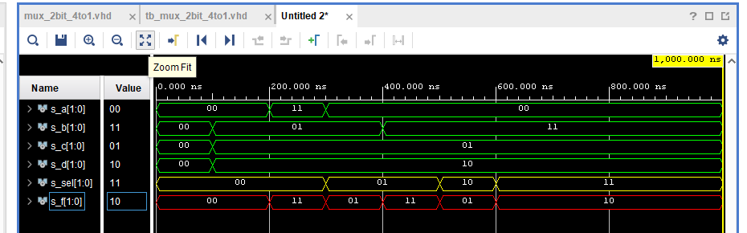

## Part 3: A Vivado tutorial  

#### Založení projektu

Kliknem na File -> Project -> New
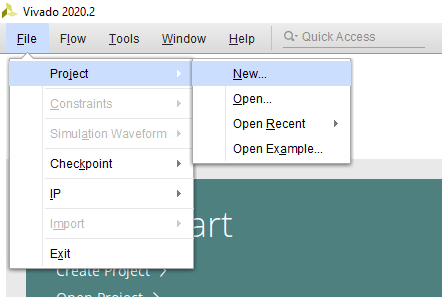

Dáme Next
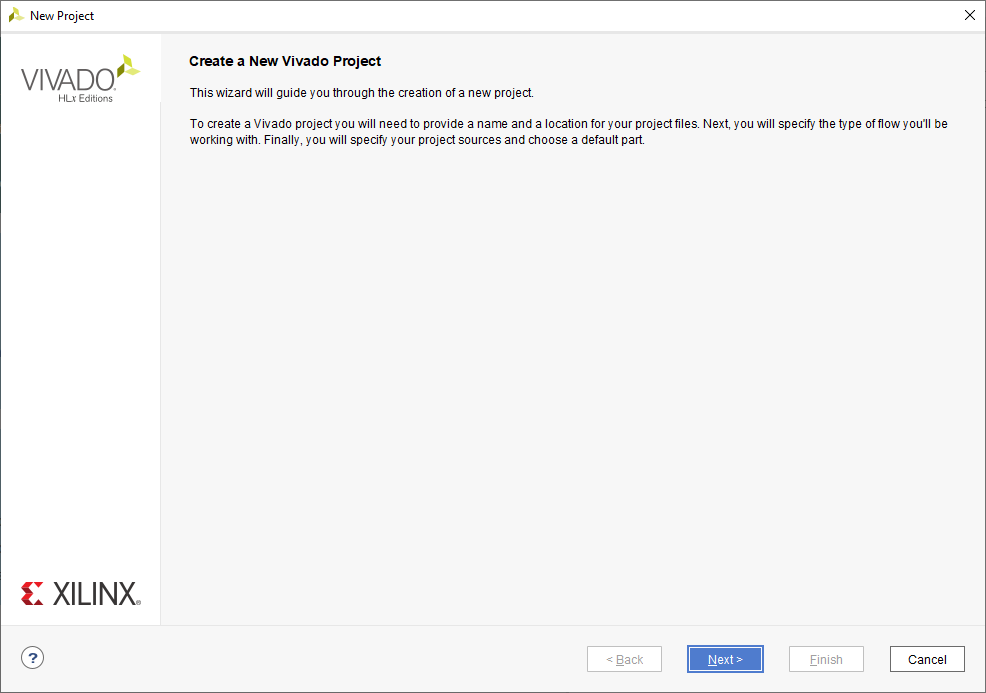

Zadáme název projektu a jeho umístění
 Vytvoří se nám složka se stejným názvem do které se projekt uloží.
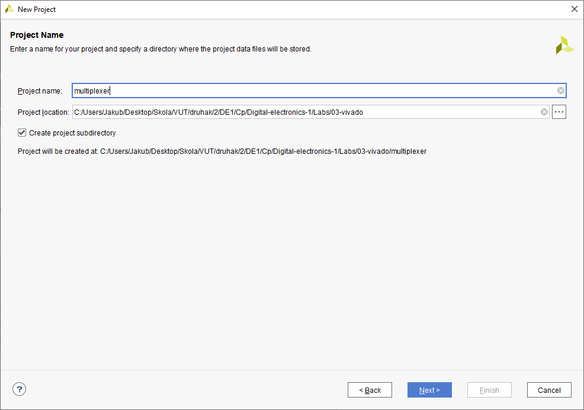

Zvolíme RTL
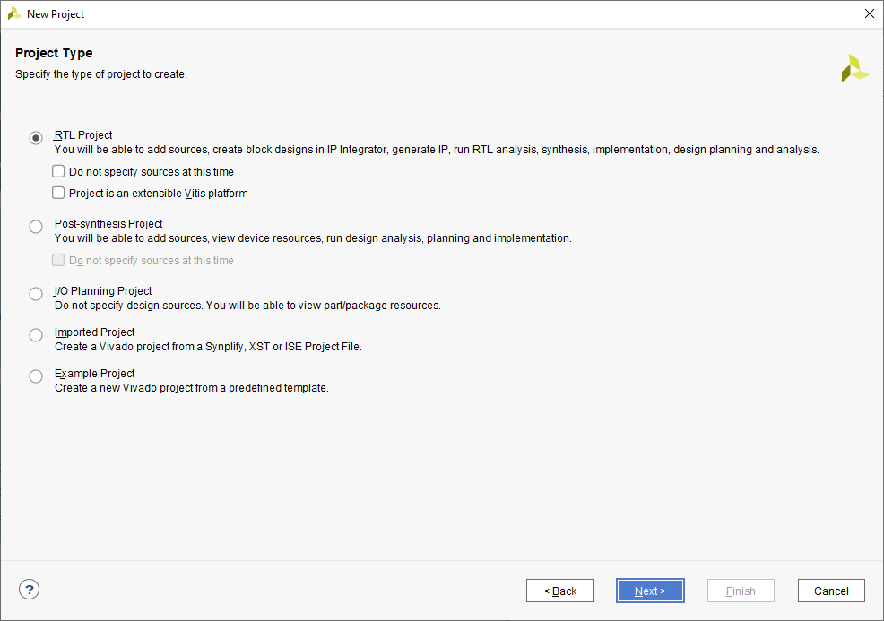

Vytvoříme VHDL source file
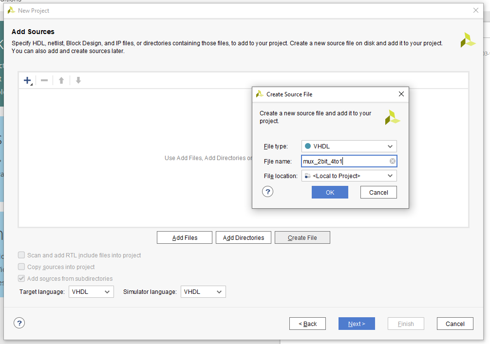

Další krok přeskočíme
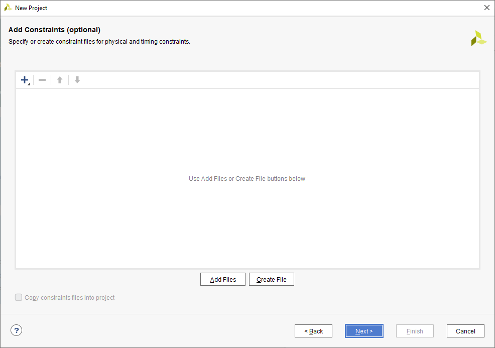

Vybereme záložku Boards a desku Nexys A7-50T
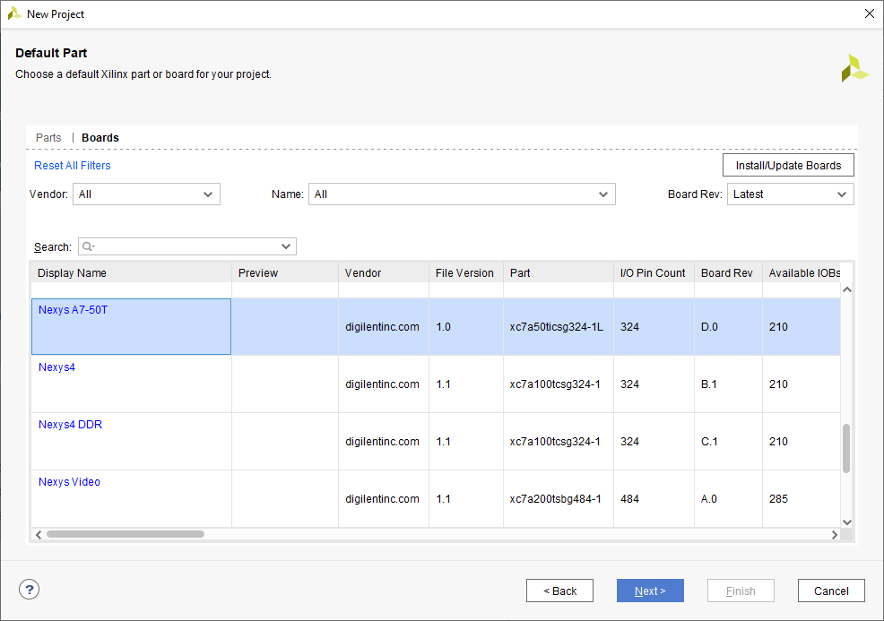

Dokončíme vytvoření projektu
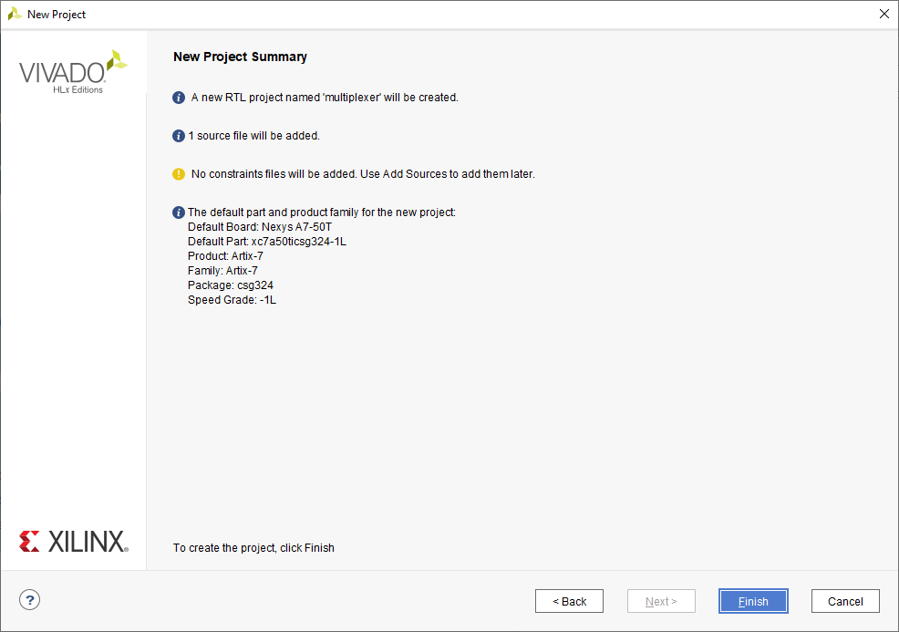

Můžeme definovat moduly
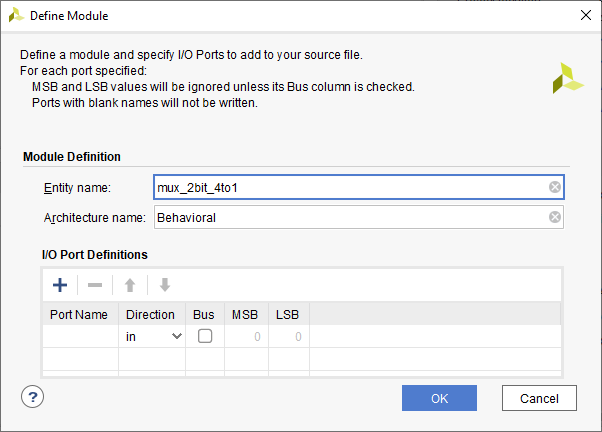

Nyní máme projekt vytvořený
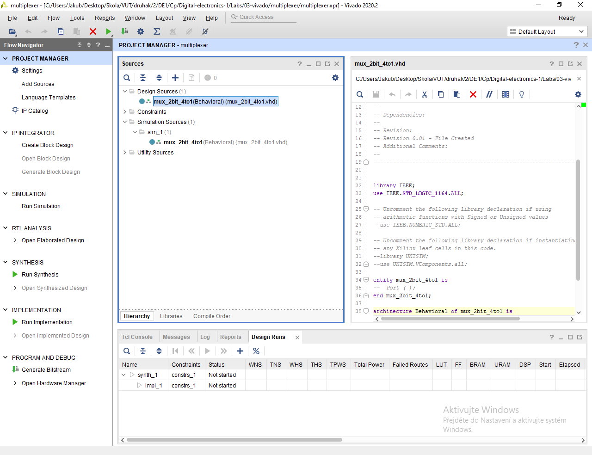

#### Vytvoření Testbench

Klikneme na File -> Add Sources
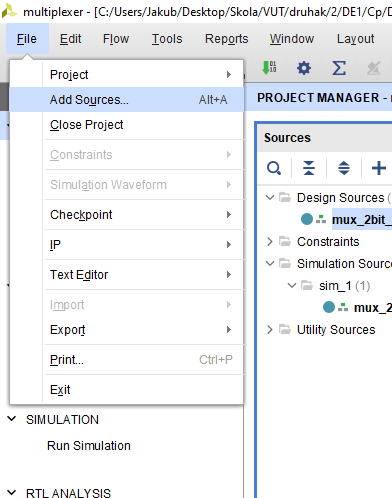

Vybereme Add or create simulation sources
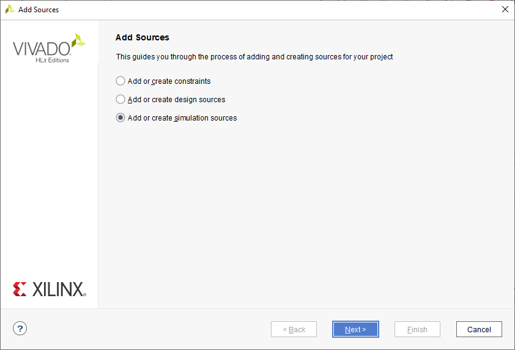

Vytvoříme source file -> tb_nazev-projektu
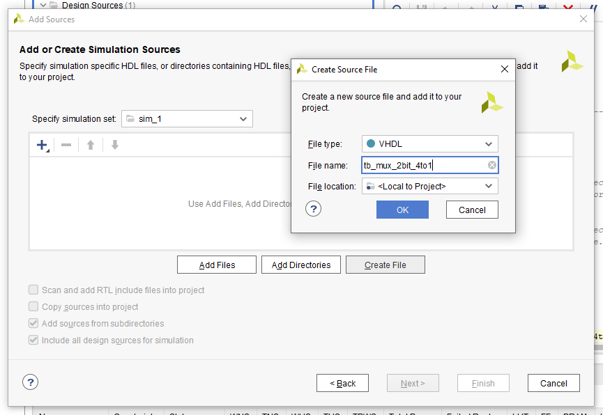

Můžeme definovat moduly
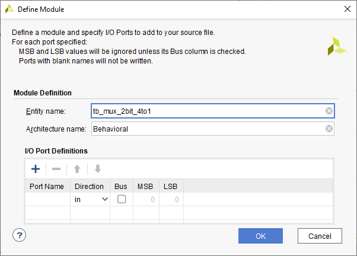

Testbech nalezneme v záložce Simulation Sources
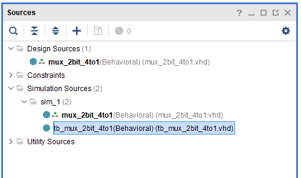

#### Spuštění simulace

Klikneme na Flow -> Run Simulation -> Run Behavioral Simulation
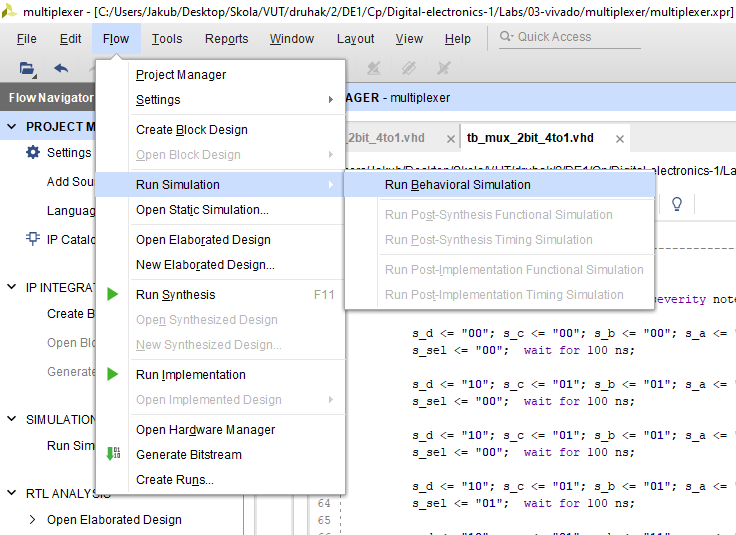

Klikneme na Zoom Fit pro lepší zobrazení průběhů


