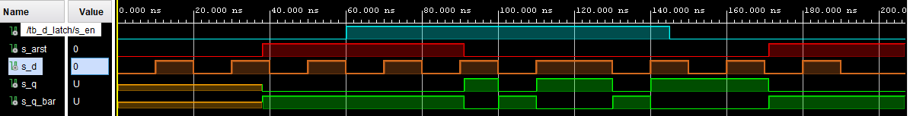
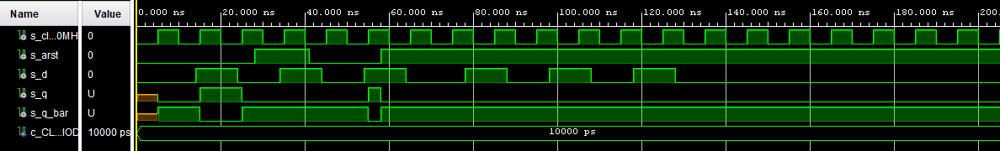

## Part 1: Preparation tasks

#### Characteristic equations and completed tables for D, JK, T flip-flops


   | **clk** | **d** | **q(n)** | **q(n+1)** | **Comments** |
   | :-: | :-: | :-: | :-: | :-- |
   |  | 0 | 0 | 0 | Sampled and stored |
   |  | 0 | 1 | 0 | Sampled and stored |
   |  | 1 | 0 | 1 | Sampled and stored |
   |  | 1 | 1 | 1 | Sampled and stored |

   | **clk** | **j** | **k** | **q(n)** | **q(n+1)** | **Comments** |
   | :-: | :-: | :-: | :-: | :-: | :-- |
   |  | 0 | 0 | 0 | 0 | No change |
   |  | 0 | 0 | 1 | 1 | No change |
   |  | 0 | 1 | 0 | 0 | Reset |
   |  | 0 | 1 | 1 | 0 | Reset |
   |  | 1 | 0 | 0 | 1 | Set |
   |  | 1 | 0 | 1 | 1 | Set |
   |  | 1 | 1 | 0 | 1 | Toggle (=invert) |
   |  | 1 | 1 | 1 | 0 | Toggle (=invert) |

   | **clk** | **t** | **q(n)** | **q(n+1)** | **Comments** |
   | :-: | :-: | :-: | :-: | :-- |
   |  | 0 | 0 | 0 | No change |
   |  | 0 | 1 | 1 | No change |
   |  | 1 | 0 | 1 | Toggle (=invert) |
   |  | 1 | 1 | 0 | Toggle (=invert) |


## Part 2: D latch
        
#### VHDL code of the process p_d_latch
```vhdl
p_d_latch : process(d, arst, en)
    begin
        if (arst = '1') then
            q     <= '0';
            q_bar <= '1';
        elsif (en = '1') then
            q     <= d;
            q_bar <= not d;
	end if;
end process p_d_latch;
```

####  VHDL reset and stimulus processes from the testbench tb_d_latch.vhd
```vhdl
p_reset_gen : process
    begin
        s_arst <= '0';
        wait for 38 ns;
	 
    -- Reset activated
        s_arst <= '1';
        wait for 53 ns;

    --Reset deactivated
        s_arst <= '0';
	
        wait for 80 ns;
        s_arst <= '1';

        wait;
    end process p_reset_gen;
    
p_stimulus : process
    begin
        report "Stimulus process started" severity note;
	
        s_d  <= '0';
	    s_en <= '0';
	
    --d sekv
	    wait for 10 ns;
	    s_d  <= '1';
	    wait for 10 ns;
	    s_d  <= '0';
	    wait for 10 ns;
	    s_d  <= '1';
	    wait for 10 ns;
	    s_d  <= '0';
	    wait for 5 ns;
	
	    assert ((s_arst = '1') and (s_en = '0') and (s_q = '0') and (s_q_bar = '1'))
	    report "Test failed for reset high, en low when s_d = '0'" severity error;
	
	    wait for 5 ns;
	    s_d  <= '1';
	    wait for 5 ns;
	
	    assert ((s_arst = '1') and (s_en = '0') and (s_q = '0') and (s_q_bar = '1'))
	    report "Test failed for reset high, en low when s_d = '1'" severity error;
	
	    wait for 5 ns;
	    s_d  <= '0';
    --/d sekv
	
	    s_en <= '1';
	
    --d sekv
	    wait for 10 ns;
	    s_d  <= '1';
	    wait for 5 ns;
	
     	assert ((s_arst = '1') and (s_en = '1') and (s_q = '0') and (s_q_bar = '1'))
        report "Test failed for reset high, en high when s_d = '1'" severity error;
	
    	wait for 5 ns;
    	s_d  <= '0';
	    wait for 5 ns;
	
	    assert ((s_arst = '1') and (s_en = '1') and (s_q = '0') and (s_q_bar = '1'))
	    report "Test failed for reset high, en high when s_d = '0'" severity error;          
	
	    wait for 5 ns;
	    s_d  <= '1';
	    wait for 10 ns;
	    s_d  <= '0';
	    wait for 10 ns;
	    s_d  <= '1';
	    wait for 5 ns;
	
	    assert ((s_arst = '0') and (s_en = '1') and (s_q = '1') and (s_q_bar = '0'))
	    report "Test failed for reset low, en high when s_d = '1'" severity error;
	
	    wait for 15 ns;
	    s_d  <= '0';
	    wait for 5 ns;
	
	    assert ((s_arst = '0') and (s_en = '1') and (s_q = '0') and (s_q_bar = '1'))
	    report "Test failed for reset low, en high when s_d = '0'" severity error;
	
	--/d sekv
	
	--d sekv
	wait for 5 ns;
	s_d  <= '1';
	wait for 5 ns;
	s_en <= '0';
	wait for 5 ns;
	s_d  <= '0';

	wait for 10 ns;
	s_d  <= '1';
	wait for 10 ns;
	s_d  <= '0';
	wait for 10 ns;
	s_d  <= '1';
	wait for 10 ns;
	s_d  <= '0';
	--/d sekv
	
	

	report "Stimulus process finished" severity note;
	wait;
end process p_stimulus;         
```

#### Simulated time waveforms


## Part 3: Flip-flops

#### VHDL code listing of the processes p_d_ff_arst, p_d_ff_rst, p_jk_ff_rst, p_t_ff_rst
p_d_ff_arst
```vhdl
p_d_ff_arst : process(clk, arst)
    begin
        if (arst = '1') then
            q <= '0';
            q_bar <= '1';
        elsif rising_edge(clk) then
            q <= d;
            q_bar <= not d;
        end if;
end process p_d_ff_arst;
```

p_d_ff_rst 
```vhdl
p_d_ff_rst : process (clk)
    begin
	if rising_edge(clk) then
	    if (rst = '1') then
	        q <= '0';
	        q_bar <= '1';
	    else
                q <= d;
	        q_bar <= not d;
	    end if;
	end if;
end process p_d_ff_rst;
```

p_jk_ff_rst 
```vhdl
p_jk_ff_rst : process (clk)
    begin
        if rising_edge(clk) then
            if (rst = '1') then
                s_q <= '0';
            else
                if (j = '0' and k = '0') then
                    s_q <= s_q;
                elsif (j = '0' and k = '1') then
                    s_q <= '0';
                elsif (j = '1' and k = '0') then
                    s_q <= '1';
                elsif (j = '1' and k = '1') then
                    s_q <= not s_q;
            
                end if;
            end if;
        end if;
end process p_jk_ff_rst;

q <= s_q;
q_bar <= not s_q;
```

p_t_ff_rst 
```vhdl
p_t_ff_rst : process (clk)
    begin
        if rising_edge(clk) then
            if (rst = '1') then
                s_q <= '0';
            elsif (t = '1') then
                s_q <= not s_q;
            end if;
        end if;

    end process p_t_ff_rst;

    q <= s_q;
    q_bar <= not s_q;
```

#### Listing of VHDL clock, reset and stimulus processes from the testbench files
tb_p_d_ff_arst
```vhdl
    --------------------------------------------------------------------
    -- Clock generation process
    --------------------------------------------------------------------
    p_clk_gen : process
        begin
            while now < 40 ms loop         -- 75 periods of 100MHz clock
                s_clk_100MHz <= '0';
                wait for c_CLK_100MHZ_PERIOD / 2;
                s_clk_100MHz <= '1';
                wait for c_CLK_100MHZ_PERIOD / 2;
            end loop;
            wait;
        end process p_clk_gen;
    
    --------------------------------------------------------------------
    -- Reset generation process
    --------------------------------------------------------------------
    p_reset_gen : process
        begin
            s_arst <= '0';
            wait for 28 ns;
            
            -- Reset activated
            s_arst <= '1';
            wait for 13 ns;
    
            --Reset deactivated
            s_arst <= '0';
            
            wait for 17 ns;
            
            s_arst <= '1';
            wait for 33 ns;
            
            wait for 660 ns;
            s_arst <= '1';
    
            wait;        
        end process p_reset_gen;    
    
    --------------------------------------------------------------------
    -- Data generation process
    --------------------------------------------------------------------
    p_stimulus : process
        begin
            report "Stimulus process started" severity note;
        
            s_d  <= '0';
        
            --d sekv
            wait for 14 ns;
            s_d  <= '1';
        wait for 2 ns;
        
            assert ((s_arst = '0') and (s_q = '1') and (s_q_bar = '0'))
            report "Test failed for reset low, after clk rising when s_d = '1'" severity error;
        
            wait for 8 ns;
            s_d  <= '0';
            wait for 6 ns;
        
            --assert()
            --report "";
        
            wait for 4 ns;
            s_d  <= '1';
            wait for 10 ns;
            s_d  <= '0';
            wait for 10 ns;
            s_d  <= '1';
            wait for 5 ns;
        
            -- verify that reset is truly asynchronous
            assert ((s_arst = '1') and (s_q = '0') and (s_q_bar = '1'))
            report "Test failed for reset high, before clk rising when s_d = '1'" severity error;
        
            wait for 5 ns;
            s_d  <= '0';
            --/d sekv
        
            --d sekv
            wait for 14 ns;
            s_d  <= '1';
            wait for 10 ns;
            s_d  <= '0';
            wait for 10 ns;
            s_d  <= '1';
            wait for 10 ns;
            s_d  <= '0';
            wait for 10 ns;
            s_d  <= '1';
            wait for 10 ns;
            s_d  <= '0';
            --/d sekv
        
       
            report "Stimulus process finished" severity note;
            wait;
        end process p_stimulus;
```

tb_p_d_ff_rst 
```vhdl
    --------------------------------------------------------------------
    -- Clock generation process
    --------------------------------------------------------------------
    p_clk_gen : process
        begin
	    while now < 40 ms loop        
	    	s_clk_100MHz <= '0';
		wait for c_CLK_100MHZ_PERIOD / 2;
		s_clk_100MHz <= '1';
		wait for c_CLK_100MHZ_PERIOD / 2;
	    end loop;
	    wait;
        end process p_clk_gen;

    --------------------------------------------------------------------
    -- Reset generation process
    --------------------------------------------------------------------

     p_reset_gen : process
	begin
		s_rst <= '0';
		wait for 28 ns;
		
		-- Reset activated
		s_rst <= '1';
		wait for 13 ns;

		--Reset deactivated
		s_rst <= '0';
		
		wait for 17 ns;
		
		s_rst <= '1';
		wait for 33 ns;
		
		wait for 660 ns;
		s_rst <= '1';

		wait;
         end process p_reset_gen;

    --------------------------------------------------------------------
    -- Data generation process
    --------------------------------------------------------------------
    p_stimulus : process
        begin
    	    report "Stimulus process started" severity note;
	
	    s_d  <= '0';
	
	    --d sekv
	    wait for 14 ns;
	    s_d  <= '1';
	    wait for 2 ns;
	
	    assert ((s_rst = '0') and (s_q = '1') and (s_q_bar = '0'))
	    report "Test failed for reset low, after clk rising when s_d = '1'" severity error;
	
	    wait for 8 ns;
	    s_d  <= '0';
	    wait for 6 ns;
	
	    --assert()
	    --report "";
	
	    wait for 4 ns;
	    s_d  <= '1';
	    wait for 10 ns;
	    s_d  <= '0';
	    wait for 10 ns;
	    s_d  <= '1';
	    wait for 5 ns;
	
	    -- verify that reset is truly synchronous
	    assert ((s_rst = '1') and (s_q = '1') and (s_q_bar = '0'))
	    report "Test failed for reset high, before clk rising when s_d = '1'" severity error;
	
	    wait for 5 ns;
	    s_d  <= '0';
	    --/d sekv
	
	    --d sekv
	    wait for 14 ns;
	    s_d  <= '1';
	    wait for 10 ns;
	    s_d  <= '0';
	    wait for 10 ns;
	    s_d  <= '1';
	    wait for 10 ns;
	    s_d  <= '0';
	    wait for 10 ns;
	    s_d  <= '1';
	    wait for 10 ns;
	    s_d  <= '0';
	    --/d sekv
   
	    report "Stimulus process finished" severity note;
	    wait;
        end process p_stimulus;
```

tb_p_jk_ff_rst 
```vhdl
    --------------------------------------------------------------------
    -- Clock generation process
    --------------------------------------------------------------------
    p_clk_gen : process
        begin
    	    while now < 40 ms loop        
		s_clk_100MHz <= '0';
		wait for c_CLK_100MHZ_PERIOD / 2;
		s_clk_100MHz <= '1';
		wait for c_CLK_100MHZ_PERIOD / 2;
	    end loop;
	    wait;
        end process p_clk_gen;

    --------------------------------------------------------------------
    -- Reset generation process
    --------------------------------------------------------------------

     p_reset_gen : process
	begin
		s_rst <= '0';
		wait for 18 ns;
		
		-- Reset activated
		s_rst <= '1';
		wait for 13 ns;

		--Reset deactivated
		s_rst <= '0';
		
		wait for 47 ns;
		
		s_rst <= '1';
		wait for 33 ns;
		
		wait for 660 ns;
		s_rst <= '1';

		wait;
         end process p_reset_gen;

    --------------------------------------------------------------------
    -- Data generation process
    --------------------------------------------------------------------
    p_stimulus : process
        begin
	    report "Stimulus process started" severity note;
	
	    s_j  <= '0';
	    s_k  <= '0';
	
	    --d sekv
	    wait for 38 ns;
	
	    assert ((s_rst = '0') and (s_j = '0') and (s_k = '0') and (s_q = '0') and (s_q_bar = '1'))
	    report "Test 'no change' failed for reset low, after clk rising when s_j = '0' and s_k = '0'" severity error;
	
	    wait for 2 ns;
	    s_j  <= '1';
	    s_k  <= '0';
	    wait for 6 ns;
	
	    assert ((s_rst = '0') and (s_j = '1') and (s_k = '0') and (s_q = '1') and (s_q_bar = '0'))
	    report "Test 'set' failed for reset low, after clk rising when s_j = '1' and s_k = '0'" severity error;
	
	    wait for 1 ns;
	    s_j  <= '0';
	    s_k  <= '1';
	    wait for 13 ns;
	
	    assert ((s_rst = '0') and (s_j = '0') and (s_k = '1') and (s_q = '0') and (s_q_bar = '1'))
	    report "Test 'reset' failed for reset low, after clk rising when s_j = '0' and s_k = '1'" severity error;
	
	    wait for 1 ns;
	    s_j  <= '1';
	    s_k  <= '0';
	    wait for 7 ns;
	    s_j  <= '1';
	    s_k  <= '1';
	
	    wait for 8 ns;
	
	    assert ((s_rst = '0') and (s_j = '1') and (s_k = '1') and (s_q = '0') and (s_q_bar = '1'))
	    report "Test 'toggle' failed for reset low, after clk rising when s_j = '1' and s_k = '1'" severity error;
	
	    wait for 2 ns;
	    s_j  <= '0';
	    s_k  <= '0';
	    wait for 7 ns;
	    s_j  <= '0';
	    s_k  <= '1';
	    wait for 7 ns;
	    s_j  <= '1';
	    s_k  <= '0';
	    wait for 7 ns;
	    s_j  <= '1';
	    s_k  <= '1';
	
	    --assert()
	    --report "";
	
	    report "Stimulus process finished" severity note;
	    wait;
        end process p_stimulus;
```

tb_p_t_ff_rst
```vhdl
--------------------------------------------------------------------
-- Clock generation process
--------------------------------------------------------------------
p_clk_gen : process
begin
	while now < 40 ms loop        
		s_clk_100MHz <= '0';
		wait for c_CLK_100MHZ_PERIOD / 2;
		s_clk_100MHz <= '1';
		wait for c_CLK_100MHZ_PERIOD / 2;
	end loop;
	wait;
end process p_clk_gen;

--------------------------------------------------------------------
-- Reset generation process
--------------------------------------------------------------------

 p_reset_gen : process
	begin
		s_rst <= '0';
		wait for 18 ns;
		
		-- Reset activated
		s_rst <= '1';
		wait for 13 ns;

		--Reset deactivated
		s_rst <= '0';
		
		wait for 47 ns;
		
		s_rst <= '1';
		wait for 33 ns;
		
		wait for 660 ns;
		s_rst <= '1';

		wait;
 end process p_reset_gen;

    --------------------------------------------------------------------

    -- Data generation process

    --------------------------------------------------------------------
    p_stimulus : process
        begin
	    report "Stimulus process started" severity note;
	
	    s_t  <= '0';
	
	    --d sekv
	    wait for 38 ns;
	
	    assert ((s_rst = '0') and (s_t = '0') and (s_q = '0') and (s_q_bar = '1'))
	    report "Test 'no change' failed for reset low, after clk rising when s_t = '0'" severity error;
	
	    wait for 2 ns;
	    s_t  <= '1';
	    wait for 6 ns;
	
	    assert ((s_rst = '0') and (s_t = '1') and (s_q = '1') and (s_q_bar = '0'))
	    report "Test 'toggle' failed for reset low, after clk rising when s_t = '1'" severity error;
	
	    wait for 1 ns;
	    s_t  <= '0';
	    wait for 13 ns;
	
	    assert ((s_rst = '0') and (s_t = '0') and (s_q = '1') and (s_q_bar = '0'))
	    report "Test 'no change' failed for reset low, after clk rising when s_t = '0'" severity error;
	
	    wait for 1 ns;
	    s_t  <= '1';
	    wait for 5 ns;
	
	    assert ((s_rst = '0') and (s_t = '1') and (s_q = '0') and (s_q_bar = '1'))
	    report "Test 'toggle' failed for reset low, after clk rising when s_t = '1'" severity error;
	    
	    wait for 12 ns;
	    s_t  <= '0';
	    wait for 7 ns;
	    s_t  <= '1';
	    wait for 7 ns;
	    s_t  <= '0';
	    wait for 7 ns;
	    s_t  <= '1';
	
	    --assert()
	    --report "";

	    report "Stimulus process finished" severity note;
	    wait;
        end process p_stimulus;
```

#### Simulated time waveforms
tb_d_ff_arst


tb_d_ff_rst


tb_jk_ff_rst


tb_t_ff_rst


## Part 4: Shift register
#### Image of the shift register schematic
